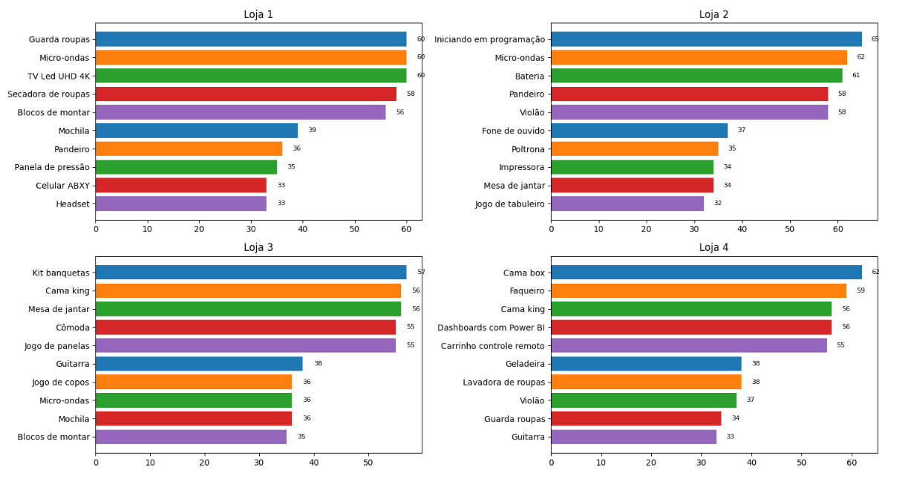

<h1 align="center">Alura Store</h1>

<table align="center">
  <tr>
    <td width="60%">
      

        Este projeto foi desenvolvido como parte de um desafio proposto pela plataforma <strong>Alura</strong>. O objetivo é ajudar o Senhor João, dono da rede Alura Store, a tomar uma decisão estratégica sobre qual loja vender para financiar um novo empreendimento.
      

      

        <strong>Atenção:</strong> Optei pela utilização do <strong>Plotly</strong> para a criação dos gráficos, com exceção de um teste feito com o <strong>Matplotlib</strong>. Portanto, ao visualizar apenas o arquivo no GitHub, sem executá-lo no Colab ou Jupyter Notebook, alguns gráficos não serão exibidos corretamente.
      

    </td>
    <td align="center" width="40%">
      
    </td>
  </tr>
</table>

  
  
  
  
  

## Visão geral da análise

---

## 📁 Estrutura do Projeto

O projeto possui a seguinte estrutura:

├── Graficos `Pasta com o PNG exportado do Plotly`

├── AluraStoreBr.ipynb `Colab Notebook com a análise de dados`

├── LICENSE `Este projeto está licenciado sob a licença MIT`

└── README.md `Página de apresentação do projeto`

---

## 🚀 Como Executar

Você pode rodar o projeto diretamente no Google Colab:

1. Acesse o notebook [`AluraStoreBr.ipynb`](./AluraStoreBr.ipynb);
2. Execute célula por célula para acompanhar toda a análise;
3. Verifique as conclusões ao final.

---

## 📈 Exemplos de Gráficos e Insights Obtidos

Durante a análise, foram criados diversos gráficos que ajudaram a visualizar o desempenho de cada loja da Alura Store. Abaixo, estão alguns exemplos com os principais insights extraídos:

### 🔹 Comparativo de Faturamento Mensal

  

**Insight**: Foi possível observar que a Loja 4 teve o menor faturamento acumulado ao longo dos meses, apresentando baixa constância nas vendas e desempenho inferior em comparação com as demais.

---

### 🔹 Avaliação Média dos Clientes por Loja

  

**Insight**: A Loja 4 também apresentou as piores avaliações por parte dos clientes, o que indica possíveis falhas no atendimento, na experiência de compra ou na qualidade dos produtos/serviços oferecidos.

---

Esses e outros indicadores sustentaram a recomendação final sobre qual loja deveria ser vendida para financiar o novo empreendimento do Senhor João.
